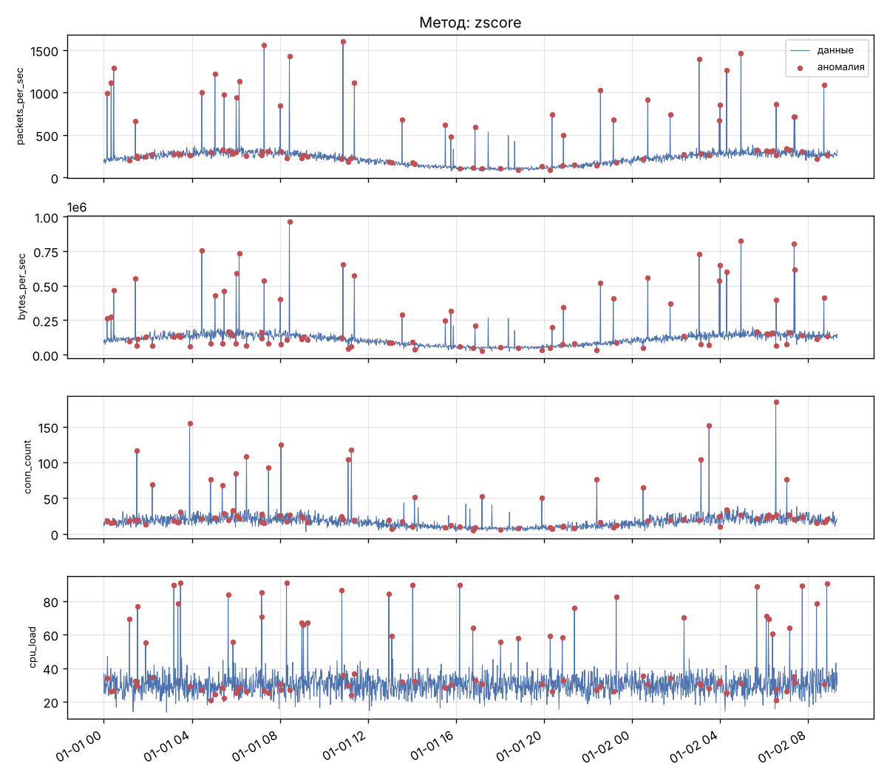

# EdgeGuard — обнаружение аномалий в IoT-телеметрии умного города на edge-устройствах

[](https://github.com/USERNAME/edge-anomaly-guard/actions/workflows/ci.yml)
[](LICENSE)


Небольшой научный программный модуль, разработанный в рамках исследования
**методов защиты инфраструктуры умного города на основе Edge AI**.
Модуль обнаруживает аномалии (возможные атаки и сбои) в сетевой и системной
телеметрии IoT-устройств и оценивает, насколько метод подходит для работы
непосредственно на периферийном устройстве: измеряет точность, задержку
обработки одной записи и размер модели.



## Возможности

- генерация синтетической телеметрии с размеченными атаками: DDoS, сканирование портов, захват устройства;
- загрузка собственных данных из CSV и их очистка;
- два детектора с единым интерфейсом:
  - **робастный Z-score** (медиана и MAD) — сверхлёгкий, для микроконтроллеров;
  - **Isolation Forest** — ансамблевый метод машинного обучения;
- метрики качества: precision, recall, F1, accuracy;
- бенчмарк ресурсов для edge-устройств: время обучения, задержка, размер модели;
- графики с отмеченными аномалиями;
- интерфейс командной строки `edgeguard`.

## Установка

Требуется Python 3.10 или новее.

```bash
git clone https://github.com/USERNAME/edge-anomaly-guard.git
cd edge-anomaly-guard
python -m venv .venv
source .venv/bin/activate        # Windows: .venv\Scripts\activate
pip install -e ".[dev]"
```

## Использование

### Командная строка

```bash
# 1. Создать синтетический набор данных (2000 записей, 5% аномалий)
edgeguard generate -o sample.csv

# 2. Найти аномалии, сохранить результат и график
edgeguard detect -i sample.csv -m iforest -o detected.csv --plot anomalies.png

# 3. Сравнить методы по точности и ресурсам
edgeguard benchmark --json benchmark.json
```

### Из Python

```python
from edgeguard import FEATURES, generate_synthetic, get_detector, classification_report

train = generate_synthetic(2000, anomaly_ratio=0.0, seed=1)   # период нормальной работы
test = generate_synthetic(2000, anomaly_ratio=0.05, seed=2)

detector = get_detector("zscore").fit(train[FEATURES].to_numpy())
pred = detector.predict(test[FEATURES].to_numpy())
print(classification_report(test["label"], pred))
```

### Формат входных данных

CSV-файл со столбцами `packets_per_sec`, `bytes_per_sec`, `conn_count`, `cpu_load`.
Столбец `label` (0 — норма, 1 — аномалия) необязателен; если он есть, выводятся метрики качества.
Реальные данные можно подготовить из открытых наборов TON_IoT или CICIoT2023,
сопоставив их поля с этими признаками.

## Результаты бенчмарка

Синтетические данные, 2000 записей, 5% аномалий, процессор x86-64:

| Метод | Precision | Recall | F1 | Задержка, мкс/запись | Размер модели |
|---|---|---|---|---|---|
| Z-score (робастный) | 1.00 | 0.90 | 0.95 | ≈0.04 | 0.5 КБ |
| Isolation Forest | 0.69 | 0.75 | 0.72 | ≈7 | 638 КБ |

На этих данных статистический метод оказался и точнее, и в сотни раз легче.
Это показывает, что для edge-устройств сложная модель не всегда лучше
и выбор метода нужно подтверждать измерениями.

## Структура проекта

```
edge-anomaly-guard/
├── src/edgeguard/
│   ├── data.py          # генерация и загрузка данных
│   ├── preprocess.py    # очистка и нормализация
│   ├── detectors.py     # детекторы аномалий
│   ├── metrics.py       # метрики качества
│   ├── benchmark.py     # оценка ресурсов для edge
│   ├── visualize.py     # графики
│   └── cli.py           # командная строка
├── tests/               # автоматические тесты (pytest)
├── docs/                # изображения для документации
├── .github/workflows/   # CI/CD (GitHub Actions)
├── pyproject.toml       # зависимости и настройки инструментов
├── CHANGELOG.md
├── CONTRIBUTING.md
└── LICENSE
```

## Выбор технологий

| Компонент | Выбор | Обоснование |
|---|---|---|
| Язык | Python 3.10+ | стандарт в науке о данных и ML; работает на Raspberry Pi и Jetson |
| Вычисления | NumPy, pandas | быстрые векторные операции, удобная работа с таблицами |
| ML | scikit-learn | проверенная реализация Isolation Forest, единый API |
| Графики | Matplotlib | стандарт научной визуализации, работает без дисплея |
| Тесты | pytest, pytest-cov | простой синтаксис, параметризация, контроль покрытия |
| Стиль кода | Ruff | линтер и форматтер в одном инструменте, очень быстрый |
| CI/CD | GitHub Actions | встроен в GitHub, бесплатен для публичных репозиториев |

## CI/CD

- [`ci.yml`](.github/workflows/ci.yml) — при каждом push и pull request: проверка стиля (Ruff),
  тесты на Python 3.10, 3.11 и 3.12 с контролем покрытия не ниже 80%,
  демонстрационный прогон, графики и бенчмарк сохраняются как артефакты сборки.
- [`release.yml`](.github/workflows/release.yml) — при создании тега `v*`:
  тесты, сборка пакета (wheel и sdist) и автоматическая публикация GitHub Release.

Выпуск новой версии:

```bash
git tag v0.1.0
git push origin v0.1.0
```

## Тестирование

```bash
ruff check . && ruff format --check .
pytest
```

31 тест, покрытие кода около 99%.

## Ограничения и планы

- методы проверены на синтетических данных; следующий шаг — проверка на TON_IoT и CICIoT2023;
- измерения выполнены на x86-64; планируется замер на Raspberry Pi;
- планируется добавить потоковую обработку и квантованные нейросетевые модели (автоэнкодер).

## Лицензия

Проект распространяется по лицензии MIT, см. [LICENSE](LICENSE).
